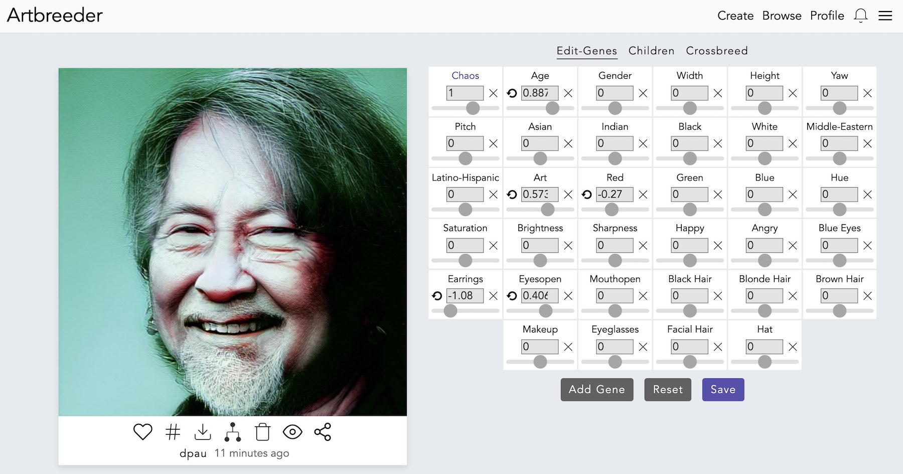
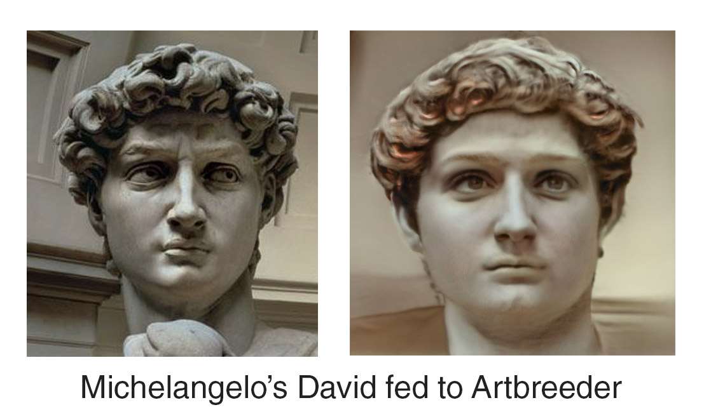
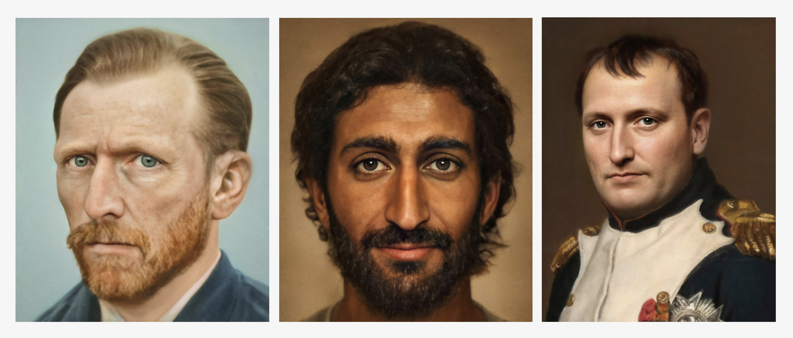
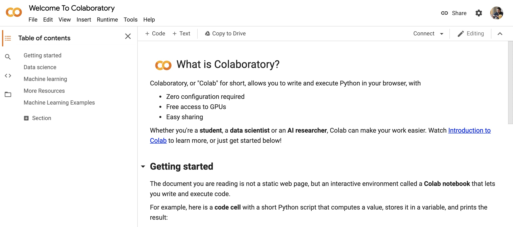
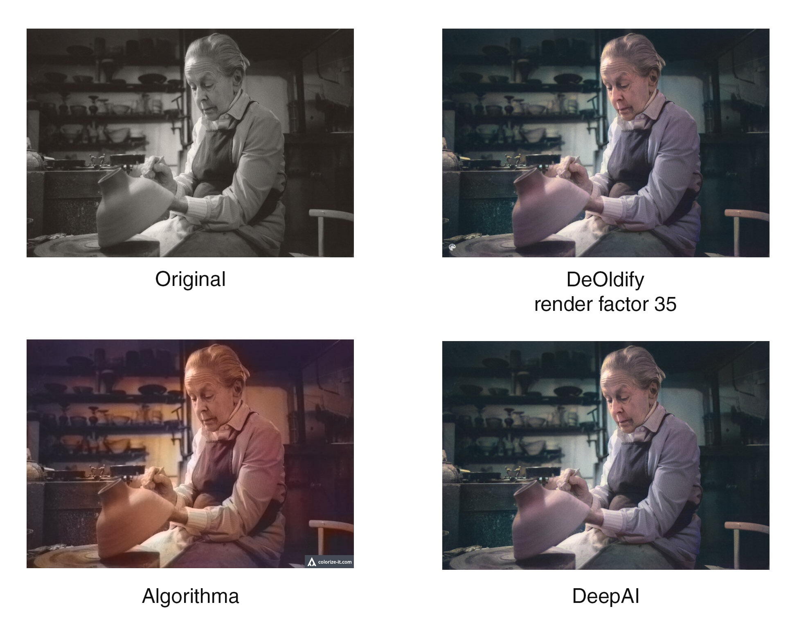

# First Steps

## Join Slack Workspace

We'll use a Slack Workspace for class discussions, questions, sharing what we're working on, and helping one another with assignments.  Please accept the invitation from Slack and try signing into the Workspace.  You can use Slack in a browser window or on your phone via the app.

[Join the Slack Workspace Here](https://join.slack.com/t/machinelearni-klp5404/shared_invite/zt-mo8x7lbr-xBrms5TEBx28mKzY1IXGjA)

## Create a Machine Learning Avatar

Each user in Slack has a profile picture.  Rather than just uploading a photo, let's create machine-learning generated version of ourselves

### [Artbreeder (https://www.artbreeder.com/create)](https://www.artbreeder.com/create) 

Artbreeder is a website that lets you "breed" machine-learning images while collaborating with others.  Click "Sign Up".  Once you are logged in, click the "Create" button, then the "Portraits" category, and finally "Upload".  After uploading an image of yourself, it may take 10-30 minutes for the photo to be processed.  Have a nice hot cup of tea.  Once the photo is processed, click on the photo and try the "Edit-Genes", "Children", and "Crossbreed" options.

This is a somewhat silly assignment, but Artbreeder will give you your first taste of generating images with a type of machine learning software called a ***GAN*** (Generative Adversarial Network), and of how to manipulate image ***styles*** like facial hair and ethnicity using ***style transfer***.

You can also try uploading photos of paintings or sculptures of heads:

#### Using Artbreeder to Make Art

The photographer Bas Uterwijk uses Artbreeder to create "real-life" portraits of historical people.  [Check out his website](https://www.basuterwijk.com/portfolio/G0000WVKM6MbiIAc), [Instagram](https://www.instagram.com/ganbrood/), and [this designboom article](https://www.designboom.com/technology/bas-sterwijk-artbreeder-ai-famous-portraits-07-11-2020/)

### Other Image-Generating Websites to Explore

If you're not satisfied with your Artbreeder avatar, feel free to try out other image-generating websites like [Deep Dream Generator](https://deepdreamgenerator.com/), [DeepArt.io](https://deepart.io/), [Fotor GoART](https://goart.fotor.com/)

### Add Your Avatar to Slack

Add your newly generated photo to Slack by clicking your user icon, then "Edit Profile", and finally "Upload an Image".

## Sign up to Google Colab

Visit [https://colab.research.google.com/](https://colab.research.google.com/)  If you are already signed into Google (for example you are logged into Gmail), you should see your user icon in the top-right corner.  If you are not logged in, click "Sign In".  Use your Google/Gmail account to log in.  If you do not have a Google/Gmail account, click "Create account" to create a new Google account, and then try visiting [https://colab.research.google.com/](https://colab.research.google.com/) again.

Once you've logged into Google Colab, you should see a "Welcome to Colaboratory" notebook:

***Note:  You do not yet need to subscribe to Google Colab Pro.  We will do so later.***

## Learn How to Use Google Colab

This video introduction to Google Colab is a bit of a slog, but it's necessary to understand for what we will do next.

<iframe width="640" height="360" src="https://www.youtube.com/embed/b2PudKFn5JY" frameborder="0" allow="accelerometer; autoplay; encrypted-media; gyroscope; picture-in-picture" allowfullscreen></iframe>

## Colorize Black & White Photos

Now that you know the basics of Google Colab, we can do something fun.  In this video we'll use [DeOldify](https://github.com/jantic/DeOldify), a type of GAN-based software, to colorize black & white photos.

To follow along with this video, you will need to open my DeOldify Colab Notebook by clicking this link:

[https://colab.research.google.com/github/derekphilipau/DeOldify/blob/master/ImageColorizerColab.ipynb](https://colab.research.google.com/github/derekphilipau/DeOldify/blob/master/ImageColorizerColab.ipynb)

<iframe width="640" height="360" src="https://www.youtube.com/embed/yTMuVcWigrU" frameborder="0" allow="accelerometer; autoplay; encrypted-media; gyroscope; picture-in-picture" allowfullscreen></iframe>

[Check out Jason Antic, the creator of DeOldify, on Twitter.](https://twitter.com/deoldify)

## Other Colorization Services

Since the release of DeOldify just a couple years ago, a number of services have incorporated automatic colorization.  Try the links below and compare to the results you got from DeOldify:

* [DeepAI: Image Colorization API](https://deepai.org/machine-learning-model/colorizer)
* [Algorithma: Colorize Photos](https://demos.algorithmia.com/colorize-photos)
* [MyHeritage Colorizer](https://www.myheritage.com/incolor) and [MyHeritage Deep Nostalgia](https://www.myheritage.com/deep-nostalgia) (Site requires credit card or PayPal for free 14-day trial.)

## Share Your Colorized Photos

Did you get any good results from DeOldify?  Share your photos in our Slack Workspace!

Did you have trouble getting DeOldify to work?  Let us know in the #technical-help channel.

## Suggested Reading

### Machine Learning and GANs

* [DeOldify: Colorizing and Restoring Old Images and Videos with Deep Learning](https://blog.floydhub.com/colorizing-and-restoring-old-images-with-deep-learning/)

The following videos are quite technical.  Don't worry about the details, just watch the images:
* [A Style-Based Generator Architecture for Generative Adversarial Networks](https://www.youtube.com/watch?v=kSLJriaOumA)
* [Synthesizing High-Resolution Images with StyleGAN2](https://www.youtube.com/watch?v=9QuDh3W3lOY)

Although fairly technical, this explanation of GANs is the best I have found:
* [Generative Adversarial Networks (GANs) - Computerphile](https://www.youtube.com/watch?v=Sw9r8CL98N0)

### Inspiration

* [AIArtists.org Featured Artists](https://aiartists.org/ai-artist-founding-members)
* [Creative Tools to Generate AI Art](https://aiartists.org/ai-generated-art-tools)
* [ML x ART](https://mlart.co/) A showcase with creative machine learning experiments

