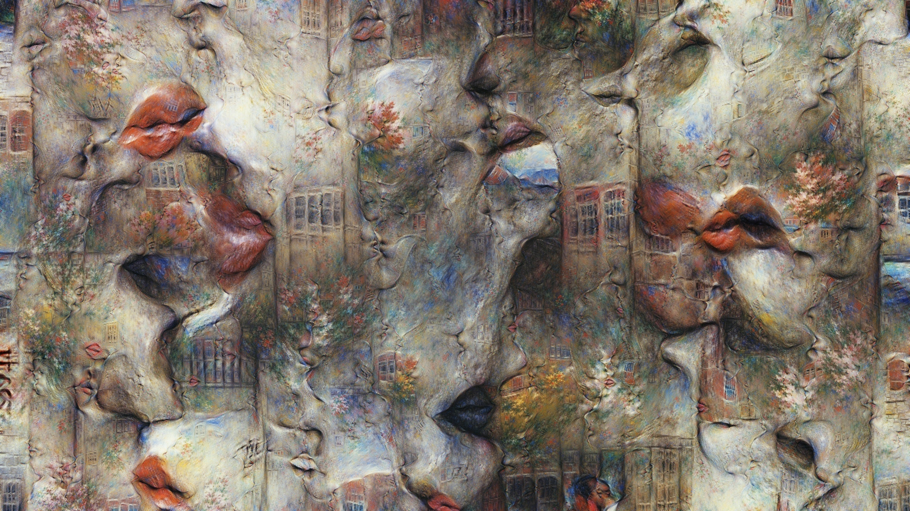
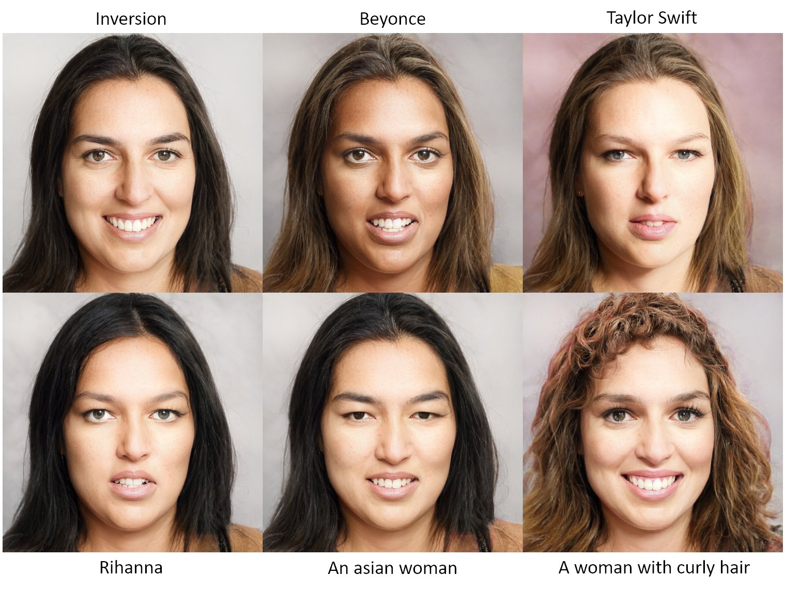
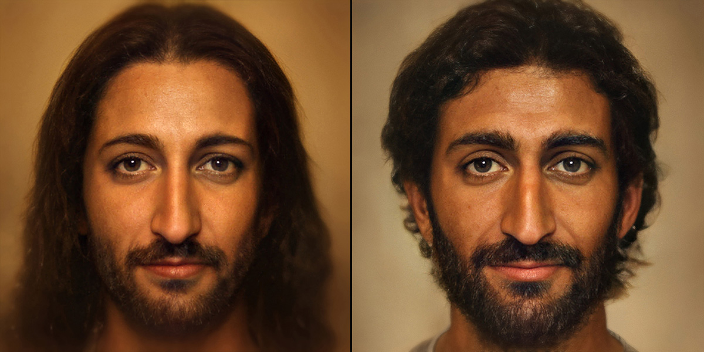

# Links

## Art

* [AIArtists.org](https://aiartists.org/ai-generated-art-tools) The world’s largest community of artists exploring the impact of AI on art & society.
    * [Featured Artists](https://aiartists.org/ai-artist-founding-members)
    * [Creative Tools to Generate AI Art](https://aiartists.org/ai-generated-art-tools)
* [ML x ART](https://mlart.co/) A showcase with creative machine learning experiments

## Websites

[Artbreeder](https://www.artbreeder.com/) Make images by mixing any Artbreeder images together. Mix a Maltese with a bubble or anything you can imagine.

## Software

* [OpenAI](https://openai.com/projects/)
    * [DALL·E: Creating Images from Text](https://openai.com/blog/dall-e/)
    * [CLIP: Connecting Text and Images](https://openai.com/blog/clip/)

## Youtube

* [Two Minute Papers (Youtube)](https://www.youtube.com/channel/UCbfYPyITQ-7l4upoX8nvctg)  Reviews of new papers in machine learning, a great way to see cutting research.

## Twitter

* [vadim epstein](https://twitter.com/eps696) multimedia vandal, numeric taxidermist, generative/interactive, new media, old school
    
* [Justin](https://twitter.com/Buntworthy) Playing with deep learning, computer vision and generative art.
* [Peter Baylies](https://twitter.com/pbaylies) Learning deeply
* [Or Patashnik](https://twitter.com/OPatashnik)
    
* [Bomze](https://twitter.com/tg_bomze) Art-Hooligan, Coder and popularizer of "Machine Learning in Art"
* [aydao](https://twitter.com/AydaoAI) Creator of "This Anime Does Not Exist" model (http://thisanimedoesnotexist.ai). Generator generator, *GAN surgeon. AI / ML / Art
* [Ganbrood (Bas Uterwijk)](https://twitter.com/ganbrood) Post Photographer Latent Spacejockey
    

# Colabs

## [Text2Image FFT](https://colab.research.google.com/drive/1rJMSyF_dmpL1kmse7Rm9TurjihJ_cA5t) 

Based on [CLIP](https://github.com/openai/CLIP) + FFT from [Lucent](https://github.com/greentfrapp/lucent) // made by [eps696](https://github.com/eps696) [Vadim Epstein]  
thanks to [Ryan Murdock](https://rynmurdock.github.io/), [Jonathan Fly](https://twitter.com/jonathanfly), [@tg-bomze](https://github.com/tg-bomze) 

* complex requests:
  * image and/or text as main prompts  
   (composition similarity controlled with [SSIM](https://github.com/Po-Hsun-Su/pytorch-ssim) loss)
  * additional text prompts for fine details and to subtract (avoid) things
  * criteria inversion (show "the opposite")

* generates [FFT-encoded](https://github.com/greentfrapp/lucent/blob/master/lucent/optvis/param/spatial.py) image (massive detailed textures, a la deepdream)
* ! fast convergence
* ! undemanding for RAM - fullHD/4K and above
* can use both CLIP models at once (ViT and RN50)

# Courses

## PyTorch 

* [Python Engineer](https://www.youtube.com/channel/UCbXgNpp0jedKWcQiULLbDTA)
    * [Deep Learning With PyTorch - Full Course](https://www.youtube.com/watch?v=c36lUUr864M&feature=youtu.be)
    * [PyTorch Tutorials - Complete Beginner Course](https://www.youtube.com/watch?v=EMXfZB8FVUA&list=PLqnslRFeH2UrcDBWF5mfPGpqQDSta6VK4)