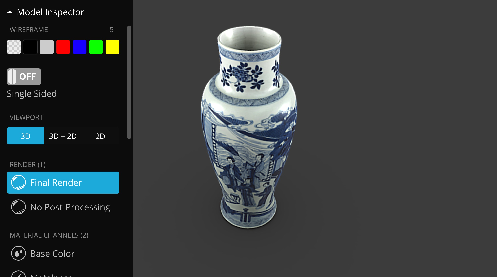
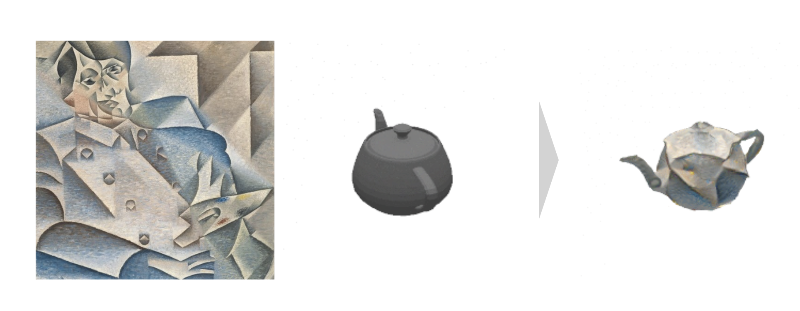

# Week 1

## Questions

How did the invention of photography influence painting?  What about digital image tools like Photoshop?  How might recent developments in 3D printing and machine learning affect art?

## 3D Digitization

A number of different methods using 3D scanning (using light) and photogammetry (using photos) have been developed to non-obtrusively scan objects in three dimensions.  Scanning systems range from expensive professional systems to cheap consumer products that can be used with a normal mobile phone camera or even drones.  The resulting 3d models can then be manipulated and printed using 3D CNC & printing techniques.

Recently, museums have undertaken 3D digitization projects in order to better study & understand objects through 3D representations.  Very soon, many museums will have full 3D catalogs of their objects which we will be able to use for research, 3D modeling, and even machine learning. 

[Victoria and Albert Museum: How was it made? 3D Scanning & Printing](https://www.youtube.com/watch?v=ztzrxeat5s8)

<iframe width="640" height="360" src="https://www.youtube.com/embed/ztzrxeat5s8" frameborder="0" allow="accelerometer; autoplay; encrypted-media; gyroscope; picture-in-picture" allowfullscreen></iframe>

[How was it made? Recreating Palmyra's Arch of Triumph using photogrammetry and CNC milling](https://www.youtube.com/watch?v=iISw5cA3HsU)

<iframe width="640" height="360" src="https://www.youtube.com/embed/iISw5cA3HsU" frameborder="0" allow="accelerometer; autoplay; encrypted-media; gyroscope; picture-in-picture" allowfullscreen></iframe>

Smithsonian Institution 3D model of a Kangxi Baluster vase (on Sketchfab):

Publically available 3D models:

* [Sketchfab: The Smithsonian Institution](https://sketchfab.com/Smithsonian)
* [Sketchfab: The British Museum](https://sketchfab.com/britishmuseum)

## 3D & ML

In these three papers published less than three years apart, you can see that it won't be long until we have consumer tools to automatically create 3D models from just a single photograph.

[AI Makes 3D Models From Photos (2017)](https://www.youtube.com/watch?v=HO1LYJb818Q)

<iframe width="640" height="360" src="https://www.youtube.com/embed/HO1LYJb818Q" frameborder="0" allow="accelerometer; autoplay; encrypted-media; gyroscope; picture-in-picture" allowfullscreen></iframe>

[This Neural Network Creates 3D Objects From Your Photos (2020)](https://www.youtube.com/watch?v=548sCh0mMRc)

<iframe width="640" height="360" src="https://www.youtube.com/embed/548sCh0mMRc" frameborder="0" allow="accelerometer; autoplay; encrypted-media; gyroscope; picture-in-picture" allowfullscreen></iframe>

## PIFuHD: Create 3D Models of People from a Single Photo

[PIFuHD](https://shunsukesaito.github.io/PIFuHD/) 

[This AI Creates A 3D Model of You!](https://www.youtube.com/watch?v=Jy_VZQnZqGk)

<iframe width="640" height="360" src="https://www.youtube.com/embed/Jy_VZQnZqGk" frameborder="0" allow="accelerometer; autoplay; encrypted-media; gyroscope; picture-in-picture" allowfullscreen></iframe>

## Create a 3D Model of Someone

In this tutorial, we're going to use PIFuHD to generate a 3D model from just a single photograph.  We can then use that model object in various 3D programs.

[Colab Notebook](https://colab.research.google.com/github/derekphilipau/machinelearningforartists/blob/main/PIFuHD_Demo.ipynb)

<iframe width="640" height="360" src="https://www.youtube.com/embed/WjvM3FcpId4" frameborder="0" allow="accelerometer; autoplay; encrypted-media; gyroscope; picture-in-picture" allowfullscreen></iframe>

## Animating 3D Models

[Finally, Instant Monsters! (2021)](https://www.youtube.com/watch?v=-Ny-p-CHNyM)

<iframe width="640" height="360" src="https://www.youtube.com/embed/-Ny-p-CHNyM" frameborder="0" allow="accelerometer; autoplay; encrypted-media; gyroscope; picture-in-picture" allowfullscreen></iframe>

## 3D Machine Learning Resources

[AvatarMe](https://www.youtube.com/watch?v=fEsgeZPN8Uw&t=39s)

[Neural 3D Mesh Renderer](https://hiroharu-kato.com/publication/neural_renderer/)

https://github.com/timzhang642/3D-Machine-Learning

## Datasets

### "Scraping"

Learn how to "scrape" or download images from the web using Google Chrome extensions:

<iframe width="640" height="360" src="https://www.youtube.com/embed/3f5Z-ivoep8" frameborder="0" allow="accelerometer; autoplay; encrypted-media; gyroscope; picture-in-picture" allowfullscreen></iframe>

* [Download All Images](https://chrome.google.com/webstore/detail/download-all-images/ifipmflagepipjokmbdecpmjbibjnakm/related)
* [Imageye Image downloader](https://chrome.google.com/webstore/detail/image-downloader-imageye/agionbommeaifngbhincahgmoflcikhm/related?hl=en-US)
* [I'm a Gentleman Image Downloader](https://chrome.google.com/webstore/detail/im-a-gentleman/afjaicccalbbickikgdegaihmajaidpd?hl=en-US)
* [Downloader for Instagram](https://chrome.google.com/webstore/detail/downloader-for-instagram/pdhejmgmdnllbiioepjcclmjichnfdaf?hl=en-US)

### Self-made

You can use image-editing software like Photoshop, digitally alter existing photos, or shoot photos on your own.

### Dataset Goal

* Related to your work/interests
* 500+ images or short texts 
* Images should be at least 512px by 512px square
* “Clean”
* Found vs. Created

### Models & Datasets

* [Hugging Face](https://huggingface.co/)
* [Kaggle](https://www.kaggle.com/datasets)
* [StyleGAN2 Models](https://github.com/justinpinkney/awesome-pretrained-stylegan2)
* [Runway ML Models](https://app.runwayml.com/models)

## Inspiration

<iframe src="https://player.vimeo.com/video/298000366?color=b4b6b7" width="640" height="360" frameborder="0" allow="autoplay; fullscreen; picture-in-picture" allowfullscreen></iframe>

<a href="https://vimeo.com/298000366">Memories of Passersby I by Mario Klingemann</a> from <a href="https://vimeo.com/onkaos">Onkaos</a> on <a href="https://vimeo.com">Vimeo</a>.

<iframe width="640" height="360" src="https://www.youtube.com/embed/LY7x2Ihqjmc" frameborder="0" allow="accelerometer; autoplay; encrypted-media; gyroscope; picture-in-picture" allowfullscreen></iframe>
