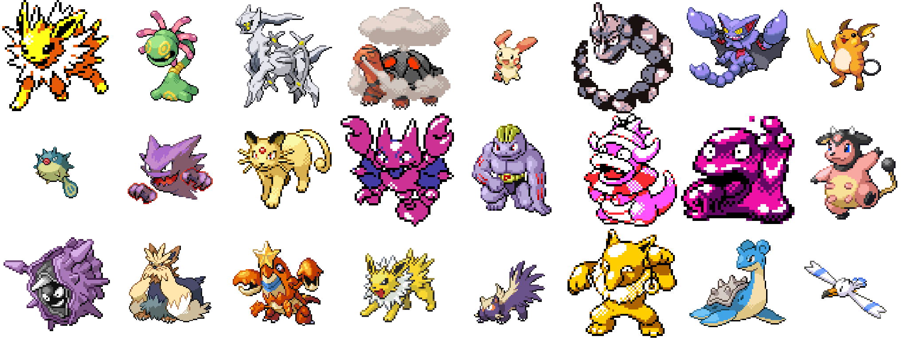

# Week 2

## 3D

[ShapeNet is an ongoing effort to establish a richly-annotated, large-scale dataset of 3D shapes.](https://shapenet.org/)

[Kaolin: A Pytorch Library for Accelerating 3D Deep Learning Research](https://github.com/NVIDIAGameWorks/kaolin)

## Enhance!

In our last class we discussed the rapid lifecycle of machine learning software from research labs to publications with open-source software and finally to commercially available software.

Just this week, Adobe released "Super Resolution", which uses machine learning to upscale images with incredible results.  Do you have any photos taken with old digital cameras?  Want to print posters of that iPhone photo?  Enhance!

<iframe width="640" height="360" src="https://www.youtube.com/embed/-uNdijku7iY" frameborder="0" allow="accelerometer; autoplay; encrypted-media; gyroscope; picture-in-picture" allowfullscreen></iframe>

## This Person Does Not Exist

Perhaps it's old news, but this video is still worth watching to see the astounding results from StyleGAN.

<iframe width="640" height="360" src="https://www.youtube.com/embed/-cOYwZ2XcAc" frameborder="0" allow="accelerometer; autoplay; encrypted-media; gyroscope; picture-in-picture" allowfullscreen></iframe>

## This Person Does Not Exist: So What?

So what if we can create realistic images of fake people?

<iframe width="640" height="360" src="https://www.youtube.com/embed/B8RMUSmIGCI" frameborder="0" allow="accelerometer; autoplay; encrypted-media; gyroscope; picture-in-picture" allowfullscreen></iframe>

## Training a GAN

This week we will be training a GAN, stylegan2-ada-pytorch, to generate images of Pokemons.  I know nothing about Pokemon, but I wanted a fairly large dataset of small images and eventually came across a website with Pokemon sprites.  These sprites are all pixel images of various Pokemon, and the images range in size from 64px to 96px.  Using Photoshop batch processing, I filled in the backgrounds with white, upscaled to 256px, and converted to RGB.  With all images now in the same format, stylegan2-ada-pytorch can create a dataset and train on them.

## Going Deeper Into GANs (Optional)

A Friendly Introduction to Generative Adversarial Networks (GANs)

In this video, Luis Serrano uses very little math to explain how to build your own GAN in "slanted land".  [For more friendly machine learning videos, check out his Youtube channel](https://www.youtube.com/channel/UCgBncpylJ1kiVaPyP-PZauQ)

<iframe width="640" height="360" src="https://www.youtube.com/embed/8L11aMN5KY8" frameborder="0" allow="accelerometer; autoplay; encrypted-media; gyroscope; picture-in-picture" allowfullscreen></iframe>

## Inspiration

Artist Refik Anadol doesn't work with paintbrushes or clay. Instead, he uses large collections of data and machine learning algorithms to create mesmerizing and dynamic installations. 

<iframe width="640" height="360" src="https://www.youtube.com/embed/I-EIVlHvHRM" frameborder="0" allow="accelerometer; autoplay; encrypted-media; gyroscope; picture-in-picture" allowfullscreen></iframe>